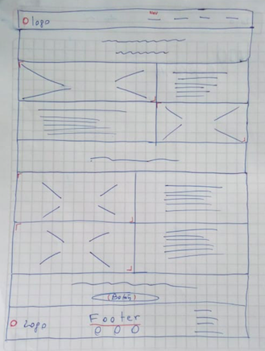
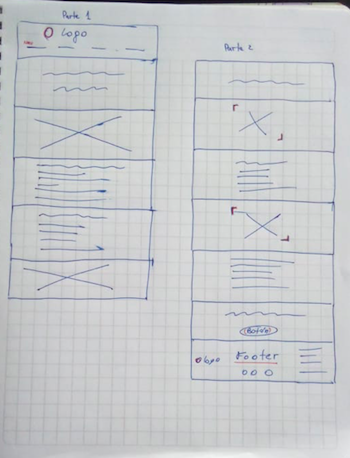

#Proceso de Maquetación

##-Requisitos del cliente

- Se debe realizar una maqueta de la página "Acerca de" tipo landing page para la empresa productora de tomates orgánicos 'Tía Tomate'.

##-Requisitos generales
 - Una barra de navegación y un footer. Cada uno mostrando el logo. En el footer se pondrán íconos de redes sociales de la página.
 - Cuatro secciones definiendo el nombre de las clases:
  - Sección "Header" donde se mostrará un título.
  - Sección "Blog" donde se dé a conocer a sus clientes un poco de la historia de la empresa y procedencia de sus productos.
  - Sección "Nosotros" donde muestre a algunas de las personas que cosechan sus verduras.
  - Sección "Compra" donde se debe dar énfasis a la compra de sus productos.
  - La página debe ser responsiva.

##-Requisitos específicos
- Íconos de redes sociales color blanco y redondeados.
 - *Usar "font awesome"*.
- Secciones con grilla
 - *Usar "bootstrap"*.
- Párrafos en general
 - *El cliente no necesita que ralicemos el contenido así que se usará "lorem ipsum"*. 
 
##-Requisitos visuales

- Layout:
 - *Usar Bootstrap*.
- Fuentes *(Usar fuentes entregadas por diseñador del mockup que están en la guía de estilos*)
 - Títulos: Relaway Bold y Relaway ExtraLight.
 - Párrafos y otros: OpenSans-Regular.
- Colores:
 - Letras #FFFFFF y #707070
 - Barra de navegación #707070
 - Letras de barra de navegación #707070
 - Footer #686963
 - Letras de footer #FFFFFF
- Imágenes: 
 - Utilizar imágenes facilitadas por el cliente.
- Íconos de redes sociales color blanco y redondeados.
 - *Usar "font awesome"*.

##*Especificación de clases

- Barra de navegación:
 - clase: navbar__navigation
 - clase navbar_tiatomate
- Sección Header 
 - clase header_tiatomate
- Sección Blog
 - clase blog__inner (para textos)
 - clase blog__inner_background (para imágenes)
- Sección Nosotros
 - clase nosotros__inner
 - clase nosotros__inner_background
- Compra 
 - clase compra
 - button__compra
- Footer
 - clase footer_tiatomate

##*Sketch del sitio

####Diseño para Desktop

####Diseño para dispositivos móviles

